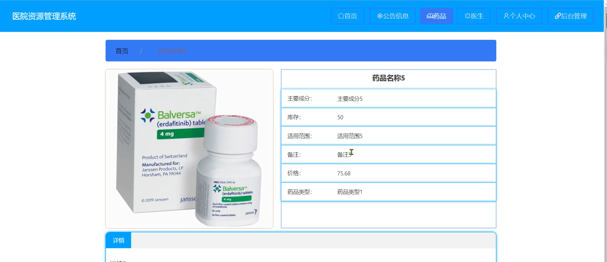

# 基于springboot的医院资源管理系统

#### 介绍

在医疗服务日益复杂和多样化的背景下，为了提高医院的运营效率和服务质量，我们开发了这个基于 Spring Boot 的医院资源管理系统。该系统旨在实现医院资源的优化配置和管理，为患者提供更优质的医疗服务，同时为医院的管理人员和医生提供便捷、高效的工作工具。

#### 技术栈

后端技术栈：Springboot+Mysql+Maven

前端技术栈：Vue+Html+Css+Javascript+ElementUI

开发工具：Idea+Vscode+Navicate

#### 系统功能介绍

（一）管理员角色  
个人中心：管理员可以在此查看和修改个人信息，接收系统通知和重要消息。  
管理员管理：对其他管理员进行管理，包括添加新管理员、修改管理员权限、删除管理员等操作，以确保管理员团队的合理配置和管理。  
病史管理：查看和管理患者的病史记录，包括疾病诊断、治疗方案、用药情况等，为医疗决策提供参考。  
基础数据管理：维护系统的基础数据，如科室设置、疾病分类、医疗项目编码等，确保系统数据的准确性和完整性。  
公告信息管理：发布医院的公告信息，如就诊须知、专家坐诊时间调整、新医疗服务项目推出等，方便患者和医生及时了解医院动态。  
药品管理：对医院的药品进行全面管理，包括药品的采购、库存管理、药品信息维护、药品有效期监控等，确保药品的供应和使用安全。  
医生管理：管理医生的信息，包括医生的个人资料、专业资质、工作安排、绩效评估等。  
医生预约管理：处理患者对医生的预约请求，合理安排医生的工作时间和患者的就诊时间，提高医疗服务的效率和质量。  
用户管理：对系统用户（包括患者）进行管理，如用户信息审核、用户权限设置、用户账号管理等。  

（二）医生角色  
公告信息：及时获取医院发布的各类公告信息，了解医院的最新规定和工作安排。  
药品：查看药品库存和药品信息，为患者开具处方时提供准确的药品选择。  
医生：查看同事的信息和工作安排，便于协作和交流。  
个人中心：修改个人资料、查看工作安排和患者反馈等。  
后台管理  
病史管理：记录和更新患者的病史信息，为患者的治疗提供连续的医疗记录。  
公告信息管理：协助管理员发布和维护公告信息。  
药品管理：对药品的使用情况进行记录和反馈，为药品管理提供实际数据支持。  
医生预约管理：查看自己的预约安排，合理调整工作时间和准备患者的诊疗方案。  
用户管理：在一定权限范围内查看患者信息，以便更好地为患者提供服务。  
住院管理：负责患者的住院安排、住院期间的治疗记录和出院管理。  

#### 系统作用

医院资源管理系统的主要作用包括：  

提升医院管理效率： 提供全面的管理工具，帮助管理员高效地管理医院的各类资源和信息，确保医院的正常运营。  
优化医生工作流程： 医生可以方便地查看和管理患者的病史、药品、预约等信息，提升工作效率和服务质量。  
改善患者就医体验： 通过高效的管理和服务流程，缩短患者的就医等待时间，提升患者的满意度。  
促进信息交流： 通过公告和管理模块，实现医院内部的信息共享和交流，增强团队协作和沟通。  

#### 系统功能截图

代码结构

数据库表

登录

前台页面首页

药品

医生

管理员端药品管理

医生预约管理

医生管理

医生端个人信息

用户管理

#### 总结

基于 Spring Boot 的医院资源管理系统通过清晰的角色划分和丰富的功能模块，实现了医院资源的高效管理和优化配置。管理员能够有效地统筹医院的各项工作，医生能够更专注于为患者提供优质的医疗服务。该系统有助于提升医院的整体运营水平和服务质量，为患者的健康和医疗事业的发展提供有力支持。

#### 使用说明

创建数据库，执行数据库脚本 修改jdbc数据库连接参数 下载安装maven依赖jar 启动idea中的springboot项目

前台登录页面
http://localhost:8080/yiyuanziyuanguanli/front/index.html

后台登录页面
http://localhost:8080/yiyuanziyuanguanli/admin/dist/index.html

管理员			账户:admin 	密码：admin
医生				账户:a1 		密码：123456